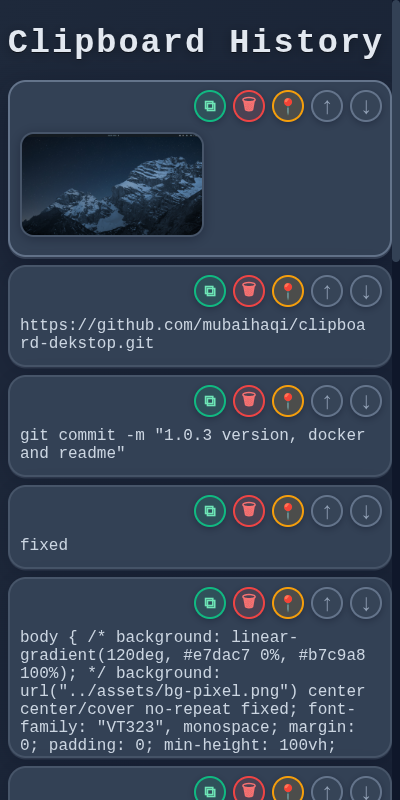

# Clipboard Manager



Sebuah manajer clipboard yang simpel namun kuat, dibangun dengan [Electron](https://www.electronjs.org/). Aplikasi ini menyimpan riwayat teks dan gambar yang Anda salin, memungkinkan Anda untuk dengan mudah mengakses, mengelola, dan menggunakannya kembali melalui antarmuka _dark mode_ yang terinspirasi dari gaya retro.

---

## ✨ Fitur

- **Riwayat Clipboard**: Secara otomatis menyimpan riwayat teks dan gambar yang Anda salin.
- **Akses dari Tray Icon**: Akses riwayat clipboard Anda dengan cepat dan mudah dari _system tray_.
- **Dark Mode Elegan**: Tema gelap yang modern dan nyaman di mata dengan sentuhan estetika retro-pixel.
- **Animasi Halus**: Animasi _fade-in/fade-out_ untuk pengalaman pengguna yang tidak mengganggu.
- **Pratinjau Gambar**: Lihat pratinjau gambar yang disalin secara langsung di dalam daftar.
- **Pin Item Penting**: Sematkan item yang sering digunakan agar tetap berada di bagian atas riwayat Anda.
- **Manajemen Mudah**:
  - **Salin**: Satu klik untuk menyalin item kembali ke clipboard Anda.
  - **Hapus**: Hapus item yang tidak lagi Anda perlukan.
  - **Pindahkan**: Geser item ke atas atau ke bawah dalam daftar.
- **Penyimpanan Persisten**: Riwayat Anda disimpan dalam file lokal, sehingga tidak akan hilang saat aplikasi ditutup.
- **Lintas Platform**: Dibangun dengan Electron, dirancang untuk berjalan di Windows, macOS, dan Linux.

---

## 🛠️ Tumpukan Teknologi (Tech Stack)

- **Framework**: [Electron](https://www.electronjs.org/)
- **Frontend**: Vanilla HTML, CSS, dan JavaScript
- **Packaging**: [electron-builder](https://www.electron.build/)

---

## 🚀 Memulai

Ikuti instruksi ini untuk menjalankan proyek di mesin lokal Anda untuk tujuan pengembangan dan pengujian.

### Prasyarat

Anda harus sudah menginstal [Node.js](https://nodejs.org/) dan `npm` (yang disertakan dengan Node.js) di sistem Anda.

### Instalasi

1.  **Clone repositori ini:**

    ```sh
    git clone https://github.com/mubaihaqi/clipboard-dekstop.git
    ```

2.  **Masuk ke direktori proyek:**

    ```sh
    cd clipboard-dekstop
    ```

3.  **Instal dependensi:**
    ```sh
    npm install
    ```

### Menjalankan Aplikasi

Untuk memulai aplikasi dalam mode pengembangan, jalankan perintah berikut:

```sh
npm start
```

Aplikasi akan berjalan, dan Anda akan melihat ikon baru di _system tray_ Anda.

---

## 📦 Membangun Aplikasi (Build)

Untuk membuat paket aplikasi yang dapat didistribusikan untuk sistem operasi Anda (misalnya, `.AppImage` untuk Linux, `.exe` untuk Windows), jalankan skrip build:

```sh
npm run build
```

Aplikasi yang sudah jadi akan tersedia di dalam direktori `dist/`.

---

## 📂 Struktur Proyek

```
clipboard-manager/
├── assets/              # Ikon tray dan gambar yang disimpan
├── renderer/            # File Frontend (Antarmuka Pengguna)
│   ├── index.html       # File HTML utama
│   └── style.css        # File styling untuk antarmuka
├── .gitignore           # File dan folder yang diabaikan oleh Git
├── history.json         # Menyimpan riwayat clipboard (dibuat otomatis)
├── main.js              # Proses utama Electron, logika backend
├── package.json         # Metadata proyek dan dependensi
├── preload.js           # Jembatan aman antara proses main dan renderer
└── README.md            # Kamu di sini!
```

---

## 📄 Lisensi

Proyek ini dilisensikan di bawah Lisensi ISC - lihat file `package.json` untuk detailnya.

---

## 🙏 Apresiasi

- Font yang digunakan: VT323 dan Fira Mono.
- Fungsionalitas inti dibangun di atas framework Electron yang hebat.
